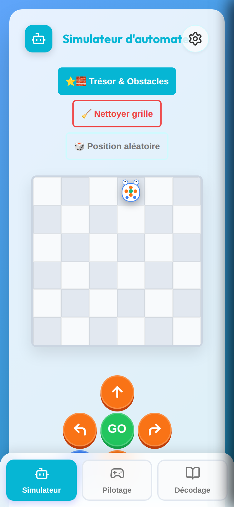
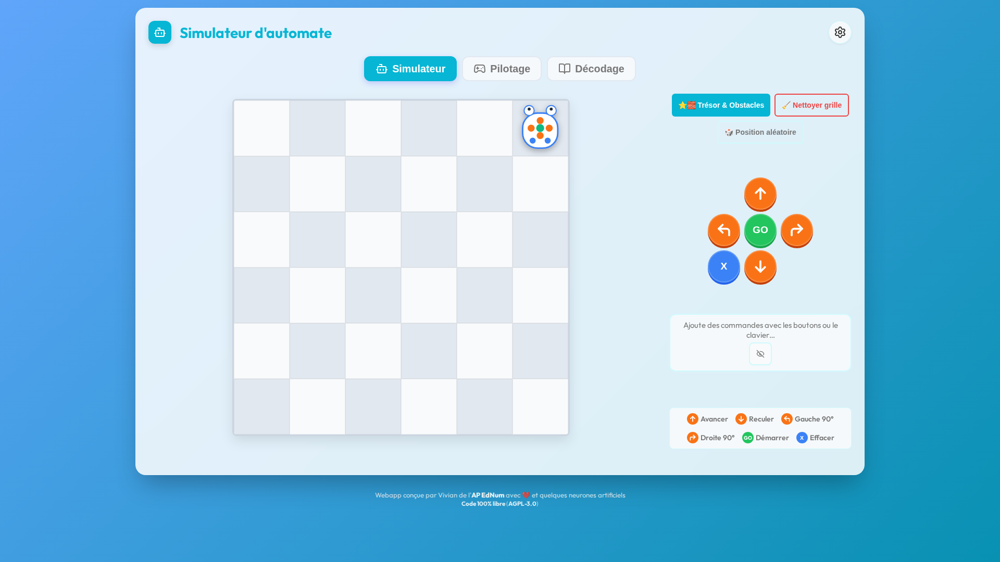
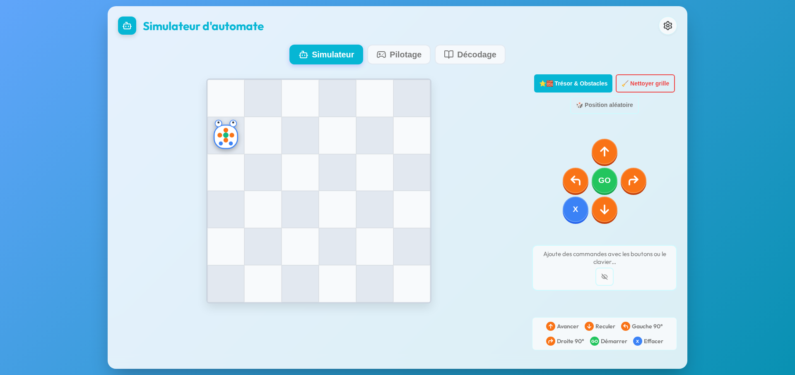
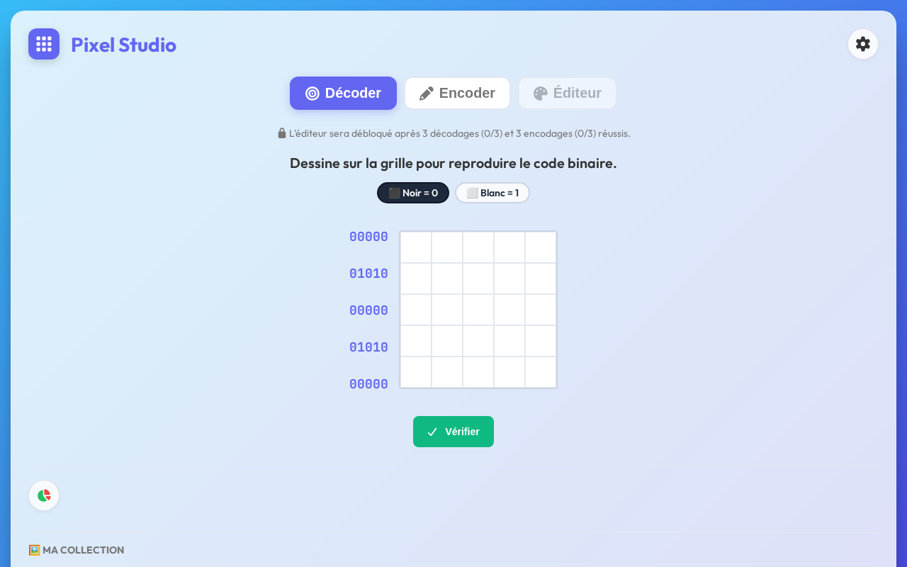
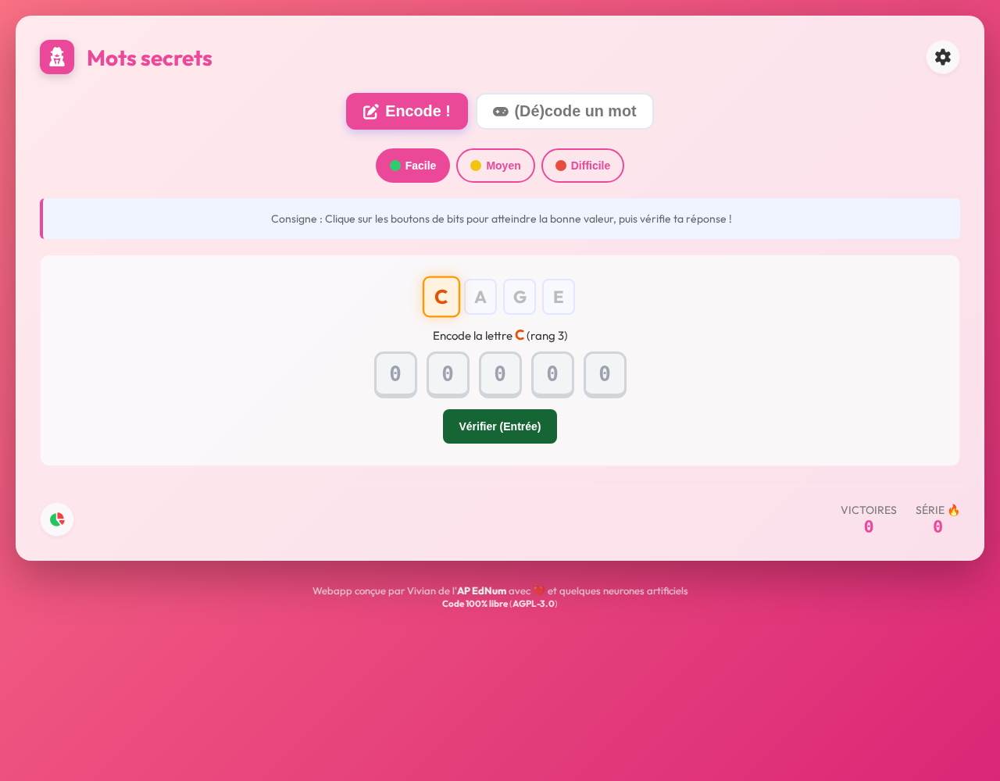
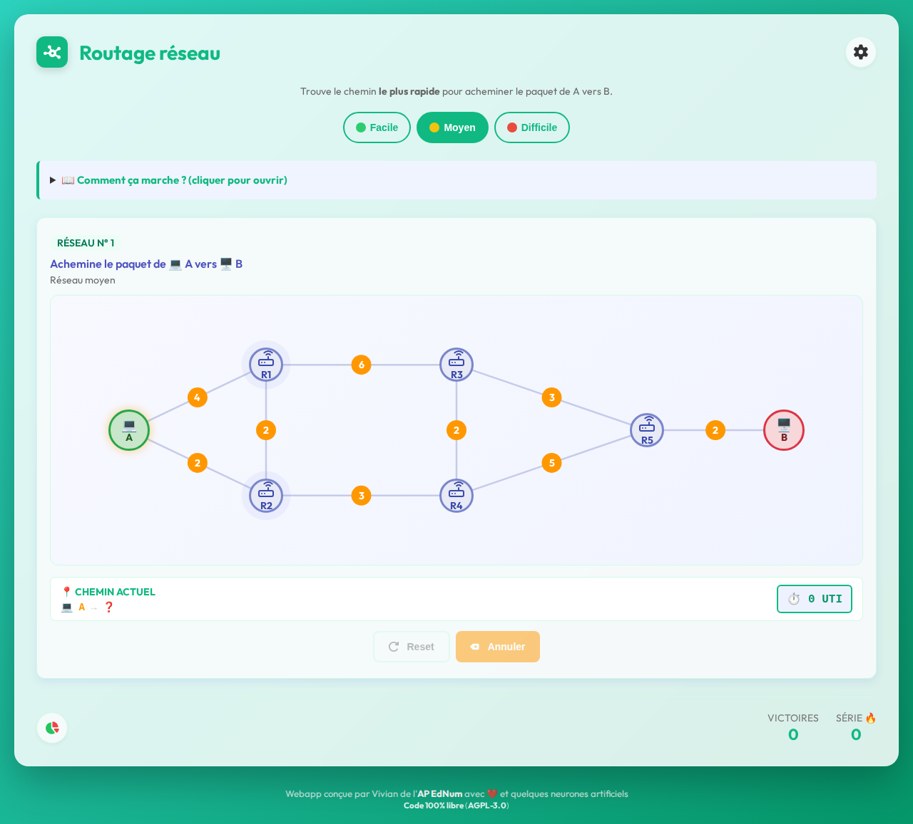
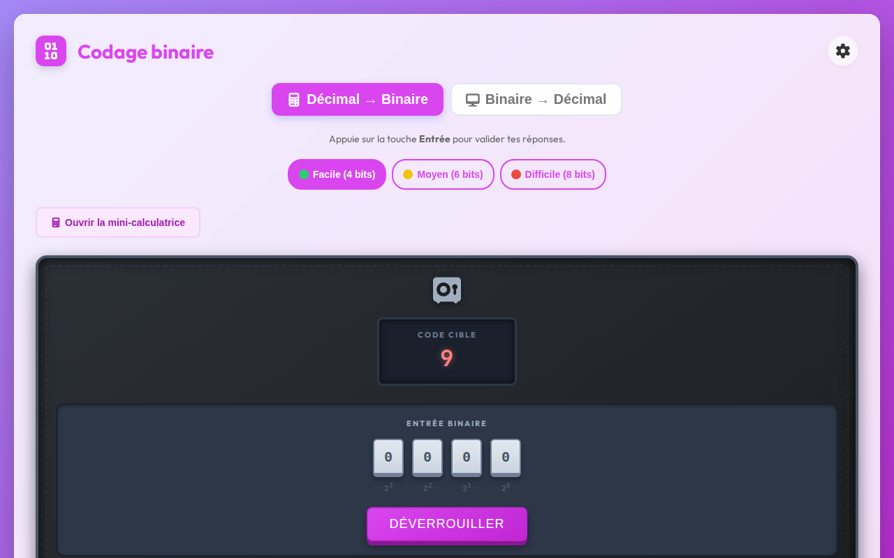
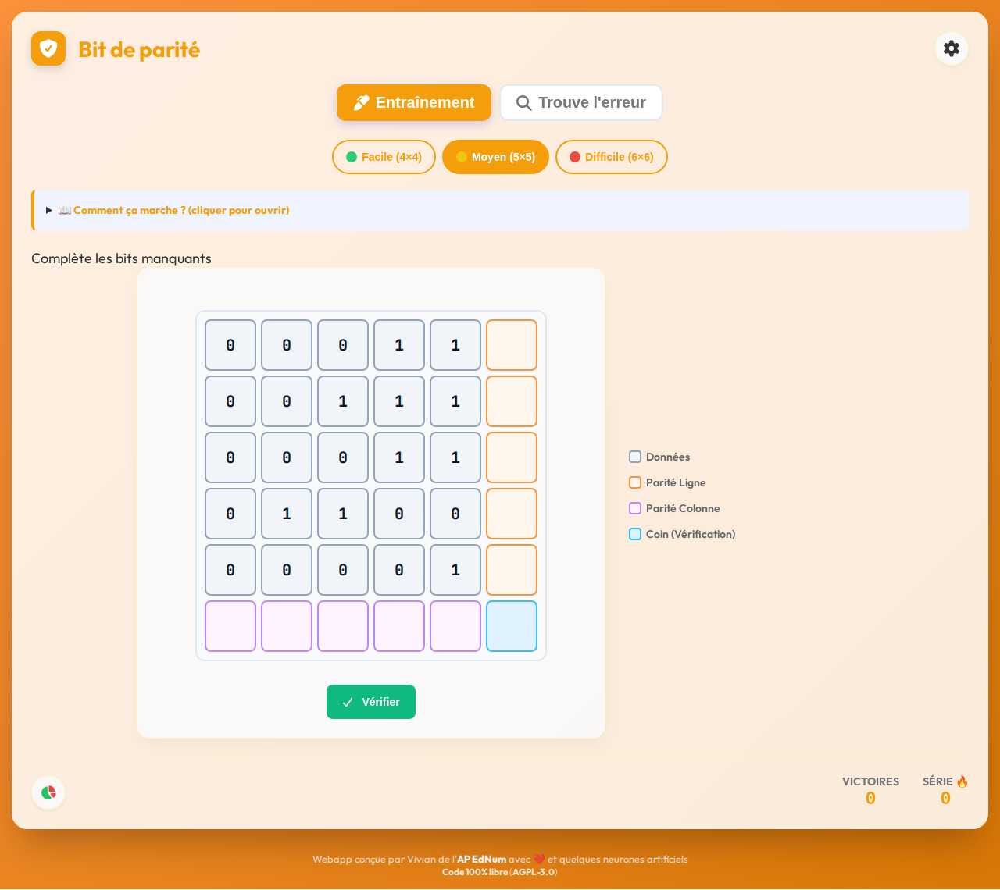
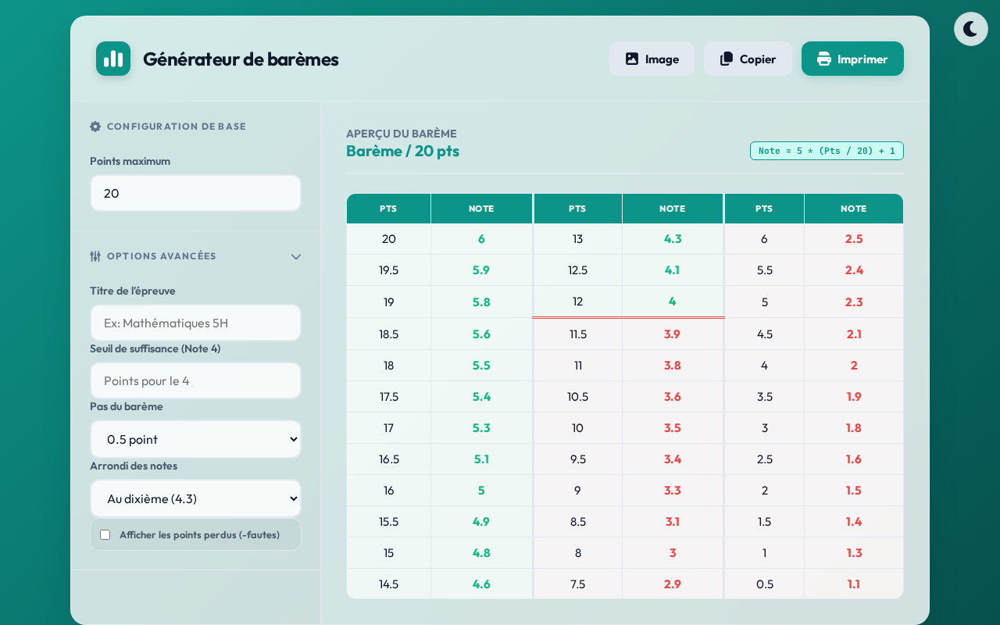
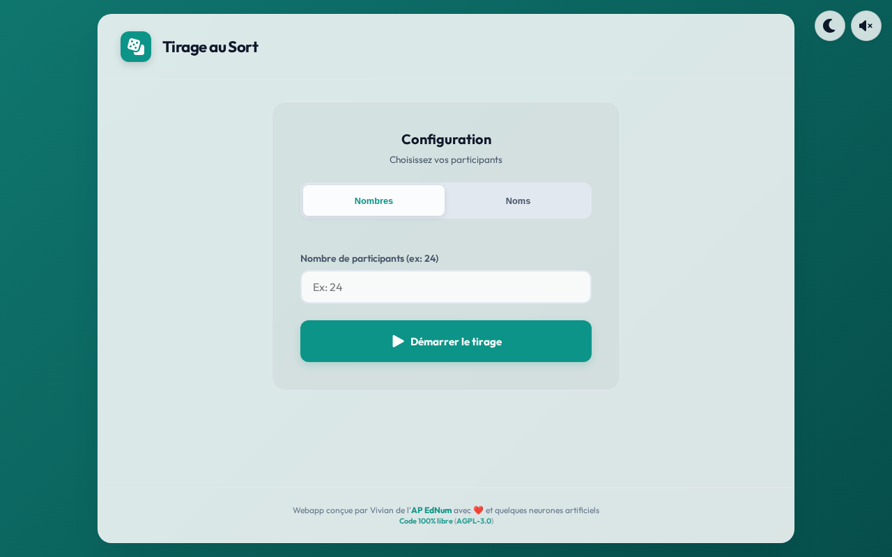

# Suite EdNum - Éducation Numérique (Webapps & Ressources)


## Présentation du projet
Ce dépôt regroupe des applications web interactives (webapps) et des ressources pédagogiques gratuites et sans publicité. Notre mission est de fournir des outils numériques de qualité, autonomes et accessibles, pour accompagner l'enseignement de la science informatique à l'école primaire (en complément des manuels [Décodage](https://decodage.edu-vd.ch/)). La philosophie pédagogique repose sur des interfaces épurées, une progression adaptative, de la gamification et une utilisation simplifiée pour permettre aux élèves et aux enseignant·e·s de se concentrer sur l'apprentissage.

## Sommaire
- [Présentation du projet](#présentation-du-projet)
- [Démarrer / Utilisation](#démarrer--utilisation)
- [Webapps (Applications pour les élèves)](#webapps-applications-pour-les-élèves)
- [Ressources (Outils pour les enseignant·e·s)](#ressources-outils-pour-les-enseignantes)
- [Architecture technique](#architecture-technique)
- [Accessibilité & Qualité](#accessibilité--qualité)
- [Contribuer](#contribuer)
- [Changelog](#changelog)
- [Contact / Support](#contact--support)
- [Licence](#licence)

## Démarrer / Utilisation

Nos outils sont conçus pour être le plus simple possible à utiliser et s'adaptent à vos besoins de déploiement :

### 📂 Structure du projet
Les fichiers dans `webapps/` et `webapps/teacher/` utilisent des ressources partagées (CSS, JS, Fonts) situées dans les dossiers racines. C'est le mode idéal pour un hébergement sur un serveur web.

### 🚀 Points forts
- **Utilisation locale :** Il n'y a **pas besoin d'installer de serveur**. Il suffit de télécharger les fichiers et de double-cliquer dessus pour les ouvrir directement dans votre navigateur web, même sans connexion internet !
- **Progressive Web App (PWA) :** Le projet intègre un Service Worker, permettant une installation sur vos appareils et un accès 100% hors-ligne après la première visite.
- **Essayez en ligne :** Vous pouvez tester directement l'ensemble des applications ici : [www.zooom.top](https://www.zooom.top).
- **Pour les enseignant·e·s :** Vous pouvez distribuer ces fichiers directement sur les ordinateurs de votre classe, ou les héberger facilement sur le site de votre école ou intranet. 

### 📱 Compatibilité Multi-Supports (Responsive Design)
Nos applications sont pensées pour s'adapter à toutes les tailles d'écran (Mobile, Tablette, Desktop, et Ecrans larges). L'interface reste claire et utilisable sur tous les supports.

Voici un exemple avec le simulateur d'automate, prouvant la compatibilité sur de multiples supports :

| Mobile | Écran large (Wide) |
|:---:|:---:|
|  |  |
| *Affichage vertical compact avec swipe* | *Exploitation complète de la largeur d'écran* |

## Webapps (Applications pour les élèves)
Ce sont des jeux interactifs conçus pour les élèves de l'école primaire qui travaillent avec les manuels scolaires *Décodage*. Vous pouvez trouver plus d'informations sur les manuels sur [https://decodage.edu-vd.ch/](https://decodage.edu-vd.ch/).

Les webapps partagent une interface unifiée basée sur un design **Glassmorphism** moderne et épuré. Elles incluent :
- **Mode Sombre global** (Dark Mode) dont le choix est conservé en mémoire.
- **Difficulté Adaptative** : Le système propose d'augmenter la difficulté de manière intelligente après plusieurs réussites parfaites.
- **Visualisation des progrès** : Graphiques circulaires (Donut Charts) détaillés avec code couleur sémantique (Vert: Succès 1er coup, Ambre: Succès après essai, Rouge: Erreurs).
- **Navigation unifiée** : Standardisation de la navigation mobile et desktop via des onglets supérieurs (`.tabs`).
- **Historique et Navigation** : Accès rapide aux applications récemment consultées sur la page d'accueil. L'icône dans l'en-tête permet un retour rapide au menu principal.
- **Typographie Outfit** pour une lisibilité optimale.

### Portail d'accueil (`index.html`)

- **À quoi sert l'outil :** Un portail central permettant d'accéder facilement à toutes les webapps et ressources. Il inclut la gestion du mode sombre global et un accès rapide aux applications récemment consultées.

Les webapps disponibles sont :

### 1. Simulateur Blue-Bot (`webapps/simulateur_bluebot.html`)

- **À quoi sert l'outil :** Un simulateur de robot programmable permettant aux élèves de découvrir les bases de la robotique et de la pensée algorithmique à travers des parcours libres et des puzzles de cheminement dynamiques.
- **Lien DÉ>CODAGE :** [3-4e](https://decodage.edu-vd.ch/3-4/) · **Scénario 2 — Automates · Blue-Bot**
- **Demi-cycle concerné :** 3-4H
- **Fonctionnalités :**
  - **Modes de jeu variés :**
    - **Simulateur :** Exploration libre et apprentissage des commandes.
    - **Pilotage :** Puzzles de cheminement avec 3 niveaux de difficulté et règles pédagogiques strictes (ex: pas de commande "reculer" en mode Facile/Moyen, obstacles obligatoires en mode Moyen).
    - **Décodage (Nouveau) :** Deux sous-modes pour travailler l'anticipation : *Destination* (prédire la case finale) et *Bug* (identifier la commande erronée dans un programme).
  - **Masquage des commandes :** Option pour cacher le programme en cours de saisie, forçant les élèves à mémoriser et anticiper mentalement leur séquence ("blind coding").
  - **Skins de robots :** Choix entre plusieurs apparences (Blue-Bot, Bee-Bot, Thymio, Dragon, Pirate, F1, Train, Cyber-Bot) modifiant également les obstacles, le sillage laissé par le robot et les récompenses. Sélection via un tiroir latéral ("drawer").
  - **Tapis Pédagogiques :** Intégration de tapis prédéfinis (ex: formes géométriques, conte de fées) et possibilité de téléverser ses propres images pour créer des tapis personnalisés, avec un curseur d'opacité ajustable pour un apprentissage thématique.
- **Valeur pédagogique :**
  - Les différents modes offrent une progression logique : le *Simulateur* pour la prise en main libre et l'expérimentation, le *Pilotage* pour la pensée algorithmique et l'identification de bugs, le *Décodage* pour travailler l'anticipation mentale et le *Dessin* pour la planification spatiale.
  - **Pensée algorithmique & Séquentialité :** L'élève doit décomposer une tâche complexe (atteindre une cible) en une série d'instructions élémentaires.
  - **Décentration cognitive :** En programmant les rotations, l'élève apprend à adopter le point de vue du robot (droite/gauche relatives), une compétence spatiale fondamentale.
  - **Anticipation & Débogage :** Le mode *Décodage* et l'option de *Blind Coding* forcent l'élève à construire une représentation mentale du programme avant son exécution, favorisant la précision et l'autocorrection.
  - **Étayage progressif :** La restriction des commandes (pas de recul) en mode facile simplifie le modèle mental initial, tandis que les obstacles en mode difficile exigent des stratégies de détour plus complexes.

### 2. Pixel Studio (`webapps/binaire_studio.html`)

- **À quoi sert l'outil :** Un studio de codage interactif permettant de faire le lien entre des images matricielles (pixels) en noir et blanc et leur représentation binaire (0 pour le noir, 1 pour le blanc).
- **Lien DÉ>CODAGE :** [5-6e](https://decodage.edu-vd.ch/5-6/) · **Scénario 4 — Codage de données, codage binaire**
- **Demi-cycle concerné :** 5-6H
- **Fonctionnalités :**
  - 3 modes de jeu : *Décoder* (dessiner à partir du code binaire), *Encoder* (trouver le code à partir d'une image) et *Éditeur Libre* (création pure).
  - Tailles de grille modulables selon la difficulté (5x5, 8x8, 10x10).
  - Sauvegarde locale d'une "Galerie" / "Collection" de ses créations.
- **Valeur pédagogique :**
  - Le mode *Décoder* permet d'appliquer mécaniquement l'algorithme de conversion, tandis que l'*Encoder* travaille l'abstraction. L'*Éditeur Libre* valorise l'expression créative en réinvestissant les acquis.
  - **Abstraction de données :** L'outil matérialise le concept de "numérisation" en montrant comment une information visuelle complexe se traduit en une suite de 0 et de 1.
  - **Dualité Encodeur/Décodeur :** En alternant entre la création d'images et la lecture de codes, l'élève comprend que le binaire est une convention de langage bidirectionnelle.

### 3. Mots secrets (`webapps/binaire_message.html`)

- **À quoi sert l'outil :** Un jeu interactif pour apprendre à chiffrer et déchiffrer des mots à l'aide de l'alphabet binaire.
- **Lien DÉ>CODAGE :** [7-8e](https://decodage.edu-vd.ch/7-8/) · **Activité 2 — Codages en folie (séance 2)**
- **Demi-cycle concerné :** 7-8H
- **Fonctionnalités :**
  - **Modes Encodeur et (Dé)codeur :** Permet de créer un message secret binaire à envoyer à un camarade ou de s'entraîner seul au décodage.
  - **Progression pédagogique :** 3 niveaux de difficulté (Facile/Moyen/Difficile) ajustant l'étendue de l'alphabet (A-G, A-O, A-Z) et les aides disponibles (alphabet complet, somme des bits ou rien).
- **Valeur pédagogique :**
  - Les deux modes permettent d'aborder le codage sous deux angles : la création de données (Encoder) et l'interprétation d'un message chiffré (Décoder).
  - **Représentation symbolique :** L'élève découvre que les lettres peuvent être représentées par des nombres, eux-mêmes encodés en binaire (prérequis au concept d'ASCII/Unicode).
  - **Arithmétique binaire & Mémoire de travail :** Le calcul mental des puissances de 2 (1, 2, 4, 8, 16) pour former le rang d'une lettre stimule les compétences numériques.
  - **Différenciation :** L'augmentation de la difficulté élargit progressivement l'alphabet utilisé (de A-G à A-Z) et supprime les aides visuelles (somme des bits), accompagnant l'élève vers une automatisation du calcul binaire.
  - **Interaction sociale :** Le mode "décodeur" encourage la collaboration en classe par l'échange de messages chiffrés, donnant du sens aux apprentissages techniques.

### 4. Routage Réseau (`webapps/routage_reseau.html`)

- **À quoi sert l'outil :** Une simulation visuelle qui demande aux élèves de trouver le chemin le plus rapide pour acheminer un "paquet" d'un point A (ordinateur) à un point B (serveur) au travers d'un graphe.
- **Lien DÉ>CODAGE :** [7-8e](https://decodage.edu-vd.ch/7-8/) · **Activité 8 — Les réseaux, Niveau 2**
- **Demi-cycle concerné :** 7-8H
- **Fonctionnalités :**
  - 3 niveaux de difficulté modifiant la taille et la complexité du réseau (génération dynamique).
  - Validateur d'optimalité qui compare le chemin de l'élève avec le chemin mathématiquement le plus court (Dijkstra).
- **Valeur pédagogique :**
  - **Optimisation sous contraintes :** L'élève apprend que le chemin le plus court "visuellement" n'est pas forcément le plus efficace (notion de coût/poids des arêtes).
  - **Heuristiques de recherche :** Face à des réseaux complexes (mode Difficile), l'élève doit développer des stratégies d'exploration de graphes, anticipant plusieurs nœuds à l'avance.
  - **Sensibilisation aux infrastructures :** L'outil démystifie le fonctionnement d'Internet en montrant que les données transitent par des routeurs intermédiaires de manière décentralisée.
  - **Différenciation :** Le passage d'un petit réseau simple (3 routeurs) à un réseau complexe (15 routeurs) accroît le nombre de nœuds et d'arêtes. Cela complexifie l'analyse combinatoire nécessaire pour identifier le chemin optimal, développant ainsi des stratégies d'optimisation et la pensée algorithmique.

### 5. Codage binaire (`webapps/binaire_codage.html`)

- **À quoi sert l'outil :** Une plateforme d'entraînement intensif au passage des nombres entiers (décimal) vers leur écriture en binaire, et inversément.
- **Lien DÉ>CODAGE :** [7-8e](https://decodage.edu-vd.ch/7-8/) · **Activité 2 — Codages en folie (séance 1)**
- **Demi-cycle concerné :** 7-8H
- **Fonctionnalités :**
  - Exercices générés aléatoirement (conversion dans les deux sens).
  - **Aide proactive & Feedback Étayé :** La mini-calculatrice binaire "pulse" visuellement après quelques secondes d'inactivité.
- **Valeur pédagogique :**
  - Le travail bidirectionnel (décimal ↔ binaire) permet de consolider la compréhension de la mécanique de la base 2 sous différents angles de calcul.
  - **Maîtrise du système positionnel :** En manipulant les puissances de 2 sur 8 bits (jusqu'à 255), l'élève renforce sa compréhension de la numération de position, utile aussi pour la base 10.
  - **Algorithmique de conversion :** Pour coder un grand nombre, l'élève doit appliquer une méthode systématique (ex: soustractions successives de la plus grande puissance possible), développant ainsi une pensée procédurale.
  - **Autonomie & Persévérance :** Le feedback adaptatif ("trop grand", "trop petit") guide l'élève sans donner la solution, favorisant l'apprentissage par essai-erreur.
  - **Différenciation :** L'augmentation de la difficulté élargit progressivement la plage des nombres à convertir (de 4 à 8 bits) et le nombre de bits à manipuler, ajustant le défi à la capacité de calcul mental et de mémorisation de l'élève.

### 6. Bit de Parité (`webapps/bit_de_parite.html`)

- **À quoi sert l'outil :** Un exercice ludique abordant la notion de parité afin de comprendre comment un ordinateur peut s'assurer qu'un message n'a pas été altéré lors d'une transmission.
- **Lien DÉ>CODAGE :** [7-8e](https://decodage.edu-vd.ch/7-8/) · **Enquête 5 — Peut-on détecter des erreurs lors de la transmission de données ?**
- **Demi-cycle concerné :** 7-8H
- **Fonctionnalités :**
  - Mode entraînement dynamique demandant de garantir la "parité paire" sur des grilles de bits.
- **Valeur pédagogique :**
  - Le mode *Entraînement* permet d'acquérir la règle logique de parité paire de manière répétitive, tandis que le mode *Trouve l'erreur* montre l'application concrète de cette règle pour la détection d'une erreur ciblée.
  - **Logique de validation :** L'élève comprend l'utilité des métadonnées (le bit de parité) pour garantir l'intégrité de l'information.
  - **Repérage spatial & Coordonnées :** La détection d'une erreur à l'intersection d'une ligne et d'une colonne impaire entraîne l'élève à utiliser des systèmes de coordonnées bidimensionnels.
  - **Esprit critique face aux données :** L'activité sensibilise au fait que les systèmes numériques sont faillibles et que l'informatique a développé des algorithmes ingénieux pour s'autocorriger.  
  - **Gestion de la complexité :** Le passage d'une petite grille à une plus grande multiplie la quantité d'informations à traiter, entraînant l'élève à adopter des méthodes de travail systématiques et rigoureuses.
  - **Différenciation :** L'augmentation de la taille de la grille (de 3×3 à 7×7), obligeant l'élève à gérer une quantité de bits plus importante et à entrainer son attention visuelle croisée pour localiser l'erreur.

## Ressources (Outils pour les enseignant·e·s)
Ce sont des outils gratuits, sans publicité, simples et faciles à utiliser, conçus spécifiquement pour les enseignant·e·s.

Les ressources disponibles sont :

Le portail propose également des liens vers diverses ressources externes utiles pour le corps enseignant.

### 7. Générateur de Barème (`webapps/teacher/bareme.html`)

- **À quoi sert l'outil :** Un petit utilitaire sans publicité permettant aux enseignants de générer instantanément un barème de points pour la correction de leurs évaluations.
- **Fonctionnalités :**
  - Génération automatique des échelles de notes selon le total saisi.
  - Thème adaptable (Clair / Sombre) avec sauvegarde des préférences en `localStorage`.
  - Formatage spécifique pour l'impression ou l'exportation en PDF (affichage propre, masquage des menus de configuration).

### 8. Tirage au Sort (`webapps/teacher/tirage.html`)

- **À quoi sert l'outil :** Un outil efficace et visuel pour désigner un·e élève au hasard lors d'activités en classe ou pour créer des dynamiques aléatoires.
- **Fonctionnalités :**
  - Sauvegarde locale automatique (`localStorage`) : la liste d'élèves et l'état du tirage restent en mémoire même si l'onglet est fermé.
  - Animation de suspense avec effets sonores désactivables.
  - Gestion fine de la liste : exclusion temporaire (élèves absents) et remise en jeu des élèves déjà tirés par simple clic.
  - Génération et copie dans le presse-papiers d'un historique complet du tirage.

## Architecture technique

Le projet repose sur une architecture **Vanilla sans aucune dépendance** :

| Principe | Détail |
|---|---|
| **Stack** | HTML / CSS / JS purs — aucun framework, aucun bundler, aucun `npm install` |
| **Offline-First** | Service Worker (`sw.js`) pré-cache toutes les ressources pour un fonctionnement 100% hors-ligne |
| **PWA** | Manifeste + SW permettant l'installation sur tous les appareils |
| **Icônes** | Subset Lucide auto-généré (`lucide-subset.js`, 15 Ko) contenant uniquement les 59 icônes utilisées |
| **Polices** | Auto-hébergées dans `assets/fonts/` (Outfit, Inter, JetBrains Mono) |
| **Audio** | Sons synthétiques via Web Audio API (`assets/js/audio.js`), aucun fichier audio externe |

### Fichiers partagés

```
assets/css/shared.css       → Design system (variables, glassmorphism, dark mode, composants)
assets/js/theme.js          → Thème clair/sombre + enregistrement Service Worker
assets/js/scores.js         → ScoreManager (gamification, stats, difficulté adaptative)
assets/js/confetti.js       → Récompenses visuelles (confettis, feux d'artifice)
assets/js/audio.js          → Audio synthétique (Web Audio API)
assets/js/swipe.js          → Navigation tactile par swipe entre onglets
assets/js/lucide-subset.js  → Icônes vectorielles (auto-généré par meta/scripts/generate_lucide_subset.js)
```

### CI/CD

Un workflow GitHub Actions (`.github/workflows/e2e-tests.yml`) exécute automatiquement les tests E2E Playwright sur chaque Pull Request vers `main`.

> Pour plus de détails sur l'architecture, voir le [Guide de contribution](CONTRIBUTING.md).

## Accessibilité & Qualité

L'accessibilité est une priorité absolue de ce projet pour répondre aux besoins de tous les élèves et enseignant·e·s :
- **Audit WCAG AA :** Tous les composants ont été audités pour garantir des ratios de contraste supérieurs à 4.5:1, assurant une lisibilité parfaite en mode clair comme en mode sombre.
- **Labels ARIA :** Chaque interaction (boutons de navigation, toggle de thème, contrôles audio) dispose d'un `aria-label` descriptif pour une compatibilité totale avec les lecteurs d'écran.
- **Navigation au clavier :** L'interface permet une navigation rapide et fluide (touche Tab, validation avec Entrée, etc.).
- **Rigueur Typographique :** Utilisation systématique de l'ellipse typographique professionnelle (`…`) et de polices optimisées pour les écrans haute définition.

## Contribuer

Les contributions sont les bienvenues ! Consultez le **[Guide de contribution](CONTRIBUTING.md)** pour les détails sur l'architecture, les conventions de code et le processus de soumission.

En résumé :
- 🐛 **Bug Reports** — Ouvrez une issue avec les étapes de reproduction
- 💡 **Feature Requests** — Décrivez le besoin pédagogique et l'impact attendu
- 🔧 **Pull Requests** — Forkez, créez une branche, testez, et soumettez

### Tests End-to-End (E2E)
Pour exécuter la suite de tests Playwright locale :
1. Installez les dépendances : `pip install pytest-playwright playwright && playwright install`
2. Démarrez un serveur HTTP local à la racine : `python -m http.server 8000`
3. Dans un autre terminal, lancez les tests : `python -m pytest meta/e2e_tests/ -v`

## Changelog

L'historique détaillé des modifications est maintenu sous forme de journal agentique dans [`meta/memory/event-log.md`](meta/memory/event-log.md). Ce fichier sert de changelog vivant, mis à jour automatiquement à chaque session de développement assisté par IA.

## Contact / Support

Si vous avez des questions, besoin de support ou si vous rencontrez un problème lors de l'utilisation de ces outils, n'hésitez pas à me contacter :
📧 **vivian.epiney [at] hepvs.ch**

## Licence
Toutes les webapps et ressources sont sous licence [AGPL-3.0](https://www.gnu.org/licenses/agpl-3.0.html).
