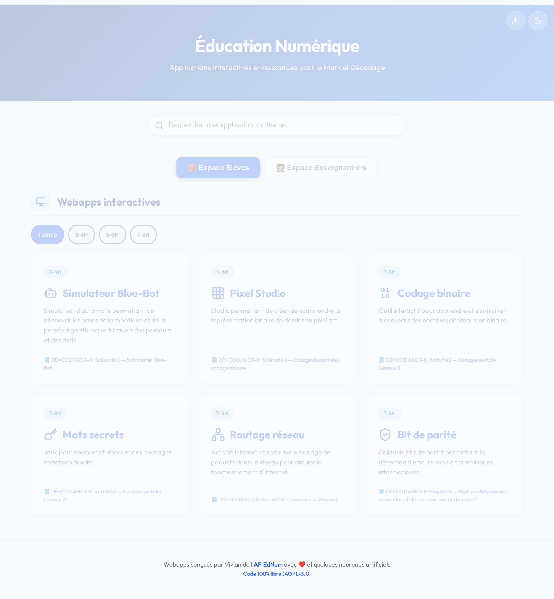
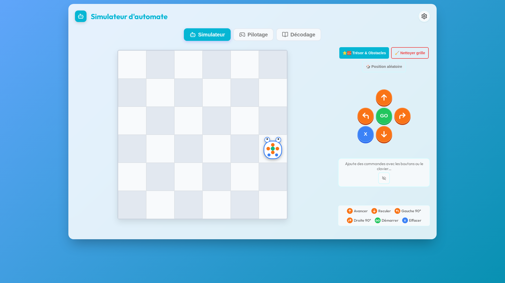
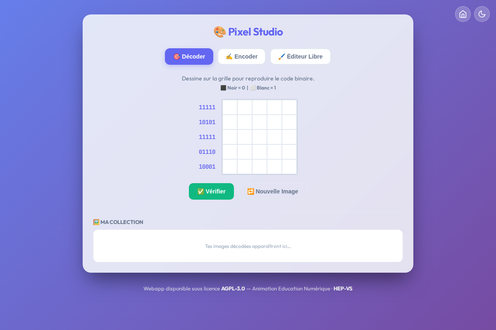
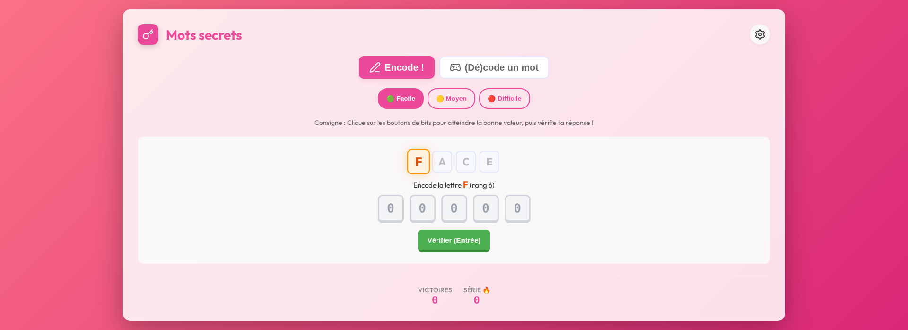
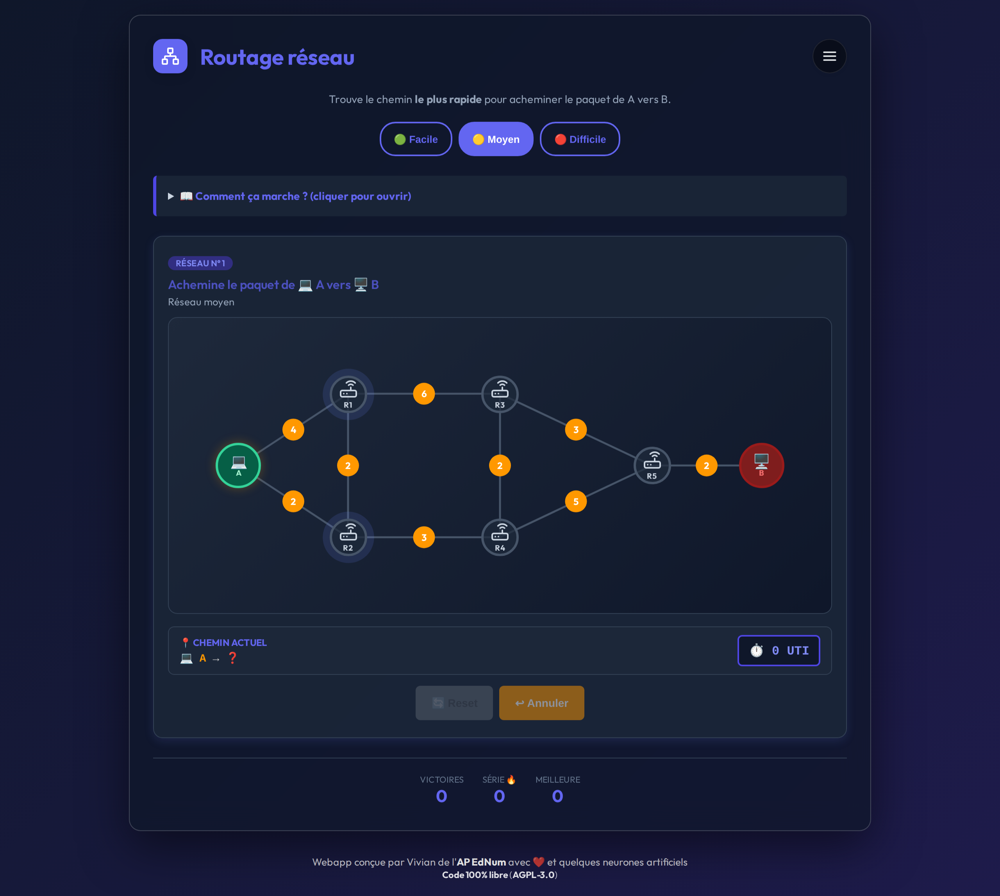
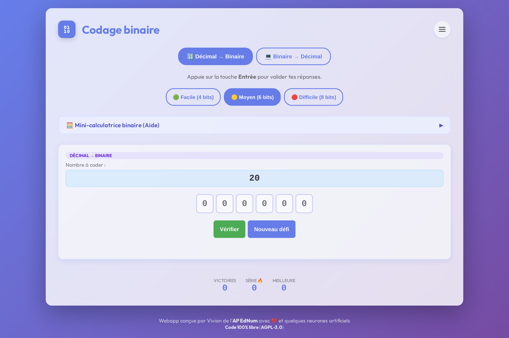
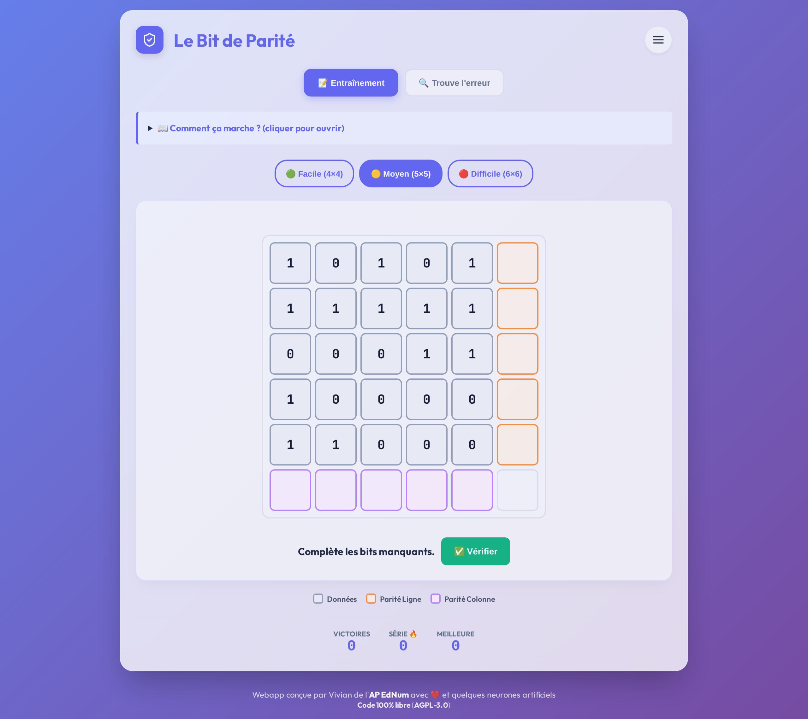
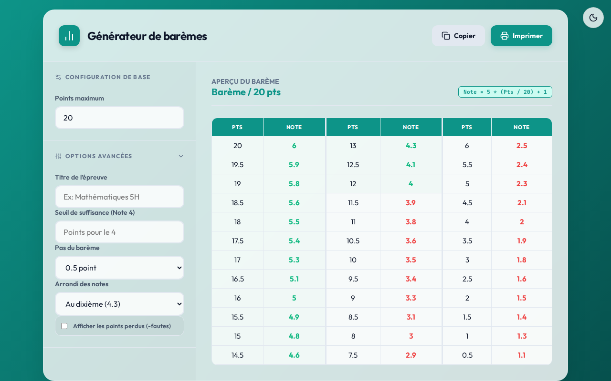
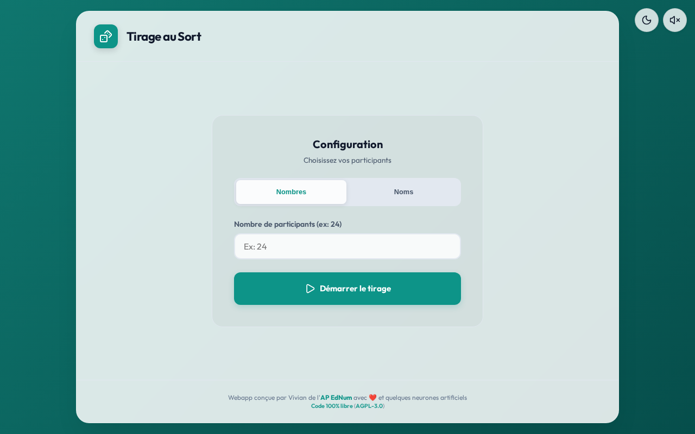

# Suite EdNum - Éducation Numérique (Webapps & Ressources)

## Présentation du projet
Ce dépôt regroupe des applications web interactives (webapps) et des ressources pédagogiques gratuites et sans publicité. Notre mission est de fournir des outils numériques de qualité, autonomes et accessibles, pour accompagner l'enseignement de la science informatique à l'école primaire (en complément des manuels [Décodage](https://decodage.edu-vd.ch/)). La philosophie pédagogique repose sur des interfaces épurées, une progression adaptative, de la gamification et une utilisation simplifiée pour permettre aux élèves et aux enseignant·e·s de se concentrer sur l'apprentissage.

## Sommaire
- [Présentation du projet](#présentation-du-projet)
- [Démarrer / Utilisation](#démarrer--utilisation)
- [Webapps (Applications pour les élèves)](#webapps-applications-pour-les-élèves)
- [Ressources (Outils pour les enseignant·e·s)](#ressources-outils-pour-les-enseignantes)
- [Accessibilité & Qualité](#accessibilité--qualité)
- [Contribuer](#contribuer)
- [Contact / Support](#contact--support)
- [Licence](#licence)

## Démarrer / Utilisation

Nos outils sont conçus pour être le plus simple possible à utiliser et s'adaptent à vos besoins de déploiement :

### 📂 Structure du projet
Les fichiers dans `webapps/` et `ressources/` utilisent des ressources partagées (CSS, JS, Fonts) situées dans les dossiers racines. C'est le mode idéal pour un hébergement sur un serveur web.

### 🚀 Points forts
- **Utilisation locale :** Il n'y a **pas besoin d'installer de serveur**. Il suffit de télécharger les fichiers et de double-cliquer dessus pour les ouvrir directement dans votre navigateur web, même sans connexion internet !
- **Essayez en ligne :** Vous pouvez tester directement l'ensemble des applications ici : [www.zooom.top](https://www.zooom.top).
- **Pour les enseignant·e·s :** Vous pouvez distribuer ces fichiers directement sur les ordinateurs de votre classe, ou les héberger facilement sur le site de votre école ou intranet. 

## Webapps (Applications pour les élèves)
Ce sont des jeux interactifs conçus pour les élèves de l'école primaire qui travaillent avec les manuels scolaires *Décodage*. Vous pouvez trouver plus d'informations sur les manuels sur [https://decodage.edu-vd.ch/](https://decodage.edu-vd.ch/).

Les webapps partagent une interface unifiée basée sur un design **Glassmorphism** moderne et épuré. Elles utilisent la typographie **Outfit** pour une lisibilité optimale et incluent de manière native un **Mode Sombre global** (Dark Mode) dont le choix est conservé en mémoire pour une expérience continue d'une application à l'autre. La page d'accueil propose également un accès rapide aux **applications récemment consultées**.

### Portail d'accueil (`index.html`)

- **À quoi sert l'outil :** Un portail central permettant d'accéder facilement à toutes les webapps et ressources. Il inclut la gestion du mode sombre global et un accès rapide aux applications récemment consultées.

Les webapps disponibles sont :

### 1. Simulateur Blue-Bot (`webapps/simulateur_bluebot.html`)

- **À quoi sert l'outil :** Un simulateur de robot programmable permettant aux élèves de découvrir les bases de la robotique et de la pensée algorithmique à travers des parcours libres et des puzzles de cheminement dynamiques.
- **Lien DÉ>CODAGE :** [3-4e](https://decodage.edu-vd.ch/3-4/) · **Scénario 2 — Automates · Blue-Bot**
- **Demi-cycle concerné :** 3-4H
- **Fonctionnalités :**
  - **Skins de robots :** Choix entre plusieurs apparences (Blue-Bot, Bee-Bot à 3 raies, Thymio, Dragon cracheur de feu) modifiant également les obstacles et les récompenses.
  - **Mode Défis intelligent :** 3 niveaux de difficulté avec règles pédagogiques strictes (ex: pas de commande "reculer" en mode Facile/Moyen, obstacles obligatoires en mode Moyen).
  - **Feedback visuel immersif :** Effet de "shake" (secousse) de toute la fenêtre lors d'une collision et mise en évidence immédiate de la commande erronée (bouton noir/blanc contrasté).
  - **Statistiques détaillées :** Suivi des récompenses récoltées et du taux de réussite "du premier coup" pour encourager la réflexion avant l'exécution.
  - **Vitesse paramétrable :** Modes "Vitesse Normale" (900 ms avec pause) ou "Vitesse Rapide" (400 ms) avec tracé du parcours en temps réel.

### 2. Pixel Studio (`webapps/binaire_studio.html`)

- **À quoi sert l'outil :** Un studio de codage interactif permettant de faire le lien entre des images matricielles (pixels) en noir et blanc et leur représentation binaire (0 pour le noir, 1 pour le blanc).
- **Lien DÉ>CODAGE :** [5-6e](https://decodage.edu-vd.ch/5-6/) · **Scénario 4 — Codage de données, codage binaire**
- **Demi-cycle concerné :** 5-6H
- **Fonctionnalités :**
  - 3 modes de jeu : *Décoder* (dessiner à partir du code binaire), *Encoder* (trouver le code à partir d'une image) et *Éditeur Libre* (création pure).
  - Tailles de grille modulables selon la difficulté (5x5, 8x8, 10x10).
  - Sauvegarde locale d'une "Galerie" / "Collection" de ses créations.
  - Exportation technique de l'œuvre finale en format image PNG.

### 3. Mots secrets (`webapps/binaire_message.html`)

- **À quoi sert l'outil :** Un jeu interactif pour apprendre à chiffrer et déchiffrer des mots à l'aide de l'alphabet binaire.
- **Lien DÉ>CODAGE :** [7-8e](https://decodage.edu-vd.ch/7-8/) · **Activité 2 — Codages en folie (séance 2)**
- **Demi-cycle concerné :** 7-8H
- **Fonctionnalités :**
  - **Modes Encodeur et (Dé)codeur :** Permet de créer un message secret binaire à envoyer à un camarade ou de s'entraîner seul au décodage.
  - **Progression pédagogique :** 3 niveaux de difficulté (Facile/Moyen/Difficile) ajustant l'étendue de l'alphabet (A-G, A-O, A-Z) et les aides disponibles (alphabet complet, somme des bits ou rien).
  - **Interface optimisée :** Saisie rapide au clavier ("Entrée") et feedback immédiat sur les erreurs de codage.

### 4. Routage Réseau (`webapps/routage_reseau.html`)

- **À quoi sert l'outil :** Une simulation visuelle qui demande aux élèves de trouver le chemin le plus rapide pour acheminer un "paquet" d'un point A (ordinateur) à un point B (serveur) au travers d'un graphe.
- **Lien DÉ>CODAGE :** [7-8e](https://decodage.edu-vd.ch/7-8/) · **Activité 8 — Les réseaux, Niveau 2**
- **Demi-cycle concerné :** 7-8H
- **Fonctionnalités :**
  - 3 niveaux de difficulté modifiant la taille et la complexité du réseau (génération dynamique).
  - Interface basée sur un canvas vectoriel (SVG) pour interagir directement sur les nœuds en cliquant.
  - Suivi en temps réel du coût du chemin (Unité de Temps/UTI).
  - Validateur d'optimalité qui compare le chemin de l'élève avec le chemin mathématiquement le plus court.

### 5. Codage binaire (`webapps/binaire_codage.html`)

- **À quoi sert l'outil :** Une plateforme d'entraînement intensif au passage des nombres entiers (décimal) vers leur écriture en binaire, et inversément.
- **Lien DÉ>CODAGE :** [7-8e](https://decodage.edu-vd.ch/7-8/) · **Activité 2 — Codages en folie (séance 1)**
- **Demi-cycle concerné :** 7-8H
- **Fonctionnalités :**
  - Exercices générés aléatoirement (conversion dans les deux sens).
  - Intégration d'une aide sous forme de "Mini-calculatrice binaire" dépliable pour aider à visualiser les puissances de 2.
  - Validation ultra-rapide au clavier (touche "Entrée") pour favoriser l'automatisme.
  - **Retour visuel dynamique :** Animations de succès (flash vert) ou d'erreur (secousse) pour un feedback immédiat.
  - **Algorithme affiné :** Génération de nombres aléatoires excluant le zéro pour garantir la pertinence pédagogique de chaque exercice.
  - **Aide proactive :** La mini-calculatrice "pulse" visuellement après quelques secondes d'inactivité pour guider l'élève sans l'interrompre.
  - **Saisie optimisée :** Focus automatique sur le champ de réponse pour enchaîner les exercices sans utiliser la souris.

### 6. Bit de Parité (`webapps/bit_de_parite.html`)

- **À quoi sert l'outil :** Un exercice ludique abordant la notion de parité afin de comprendre comment un ordinateur peut s'assurer qu'un message n'a pas été altéré lors d'une transmission.
- **Lien DÉ>CODAGE :** [7-8e](https://decodage.edu-vd.ch/7-8/) · **Enquête 5 — Peut-on détecter des erreurs lors de la transmission de données ?**
- **Demi-cycle concerné :** 7-8H
- **Fonctionnalités :**
  - Mode entraînement dynamique demandant de garantir la "parité paire" sur des grilles de bits.
  - 3 tailles de grilles pour adapter la complexité cognitive : 4x4, 5x5, ou 6x6.
  - Mode "Tour de Magie" : simulation du tour de détection d'une cellule retournée (Activité 10 — Cartes magiques).
  - Système de suivi des scores (victoires globales, série de victoires 🔥, meilleur score).
  - **Assistance au survol :** Survoler une case de parité met en surbrillance la ligne ou la colonne correspondante pour aider à la visualisation du contrôle d'intégrité.

## Ressources (Outils pour les enseignant·e·s)
Ce sont des outils gratuits, sans publicité, simples et faciles à utiliser, conçus spécifiquement pour les enseignant·e·s.

Les ressources disponibles sont :

### 7. Générateur de Barème (`ressources/bareme.html`)

- **À quoi sert l'outil :** Un petit utilitaire sans publicité permettant aux enseignants de générer instantanément un barème de points pour la correction de leurs évaluations.
- **Fonctionnalités :**
  - Génération automatique des échelles de notes selon le total saisi.
  - Thème adaptable (Clair / Sombre) avec sauvegarde des préférences en `localStorage`.
  - Formatage spécifique pour l'impression ou l'exportation en PDF (affichage propre, masquage des menus de configuration).

### 8. Tirage au Sort (`ressources/tirage.html`)

- **À quoi sert l'outil :** Un outil efficace et visuel pour désigner un·e élève au hasard lors d'activités en classe ou pour créer des dynamiques aléatoires.
- **Fonctionnalités :**
  - Sauvegarde locale automatique (`localStorage`) : la liste d'élèves et l'état du tirage restent en mémoire même si l'onglet est fermé.
  - Animation de suspense avec effets sonores désactivables.
  - Gestion fine de la liste : exclusion temporaire (élèves absents) et remise en jeu des élèves déjà tirés par simple clic.
  - Génération et copie dans le presse-papiers d'un historique complet du tirage.

## Accessibilité & Qualité

L'accessibilité est une priorité absolue de ce projet pour répondre aux besoins de tous les élèves et enseignant·e·s :
- **Audit WCAG AA :** Tous les composants ont été audités pour garantir des ratios de contraste supérieurs à 4.5:1, assurant une lisibilité parfaite en mode clair comme en mode sombre.
- **Labels ARIA :** Chaque interaction (boutons de navigation, toggle de thème, contrôles audio) dispose d'un `aria-label` descriptif pour une compatibilité totale avec les lecteurs d'écran.
- **Navigation au clavier :** L'interface permet une navigation rapide et fluide (touche Tab, validation avec Entrée, etc.).
- **Rigueur Typographique :** Utilisation systématique de l'ellipse typographique professionnelle (`…`) et de polices optimisées pour les écrans haute définition.

## Contribuer

Les contributions sont les bienvenues ! Que ce soit pour signaler un bug (Bug Reports), proposer de nouvelles fonctionnalités (Feature Requests) ou soumettre des améliorations (Pull Requests), n'hésitez pas à participer à ce projet éducatif.

## Contact / Support

Si vous avez des questions, besoin de support ou si vous rencontrez un problème lors de l'utilisation de ces outils, n'hésitez pas à me contacter :
📧 **vivian.epiney [at] hepvs.ch**

## Licence
Toutes les webapps et ressources sont sous licence [AGPL-3.0](https://www.gnu.org/licenses/agpl-3.0.html).
