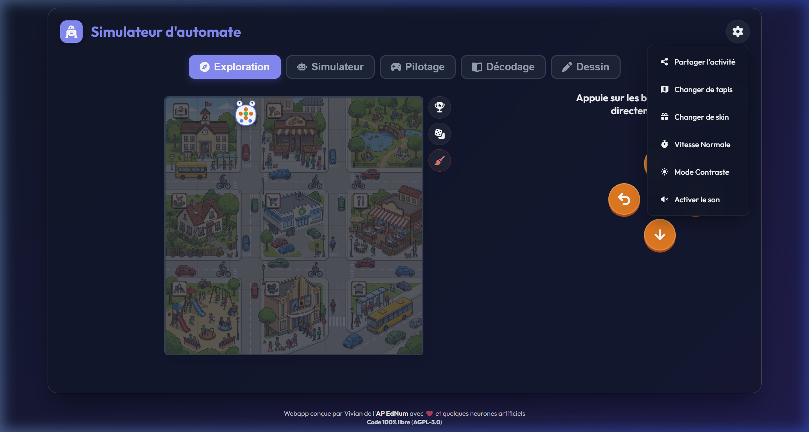
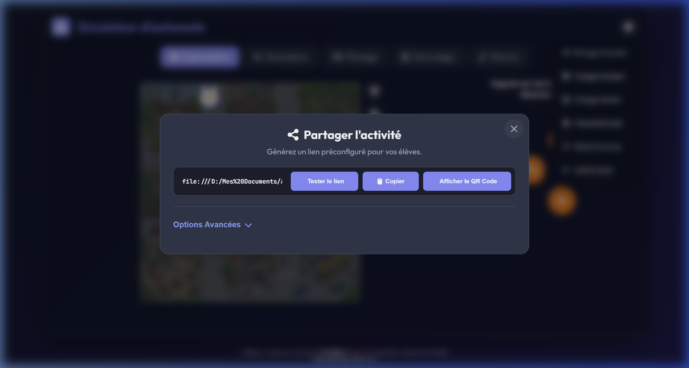
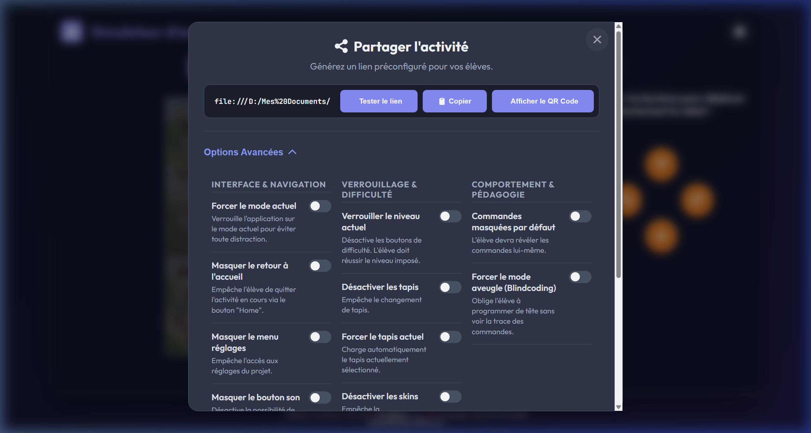
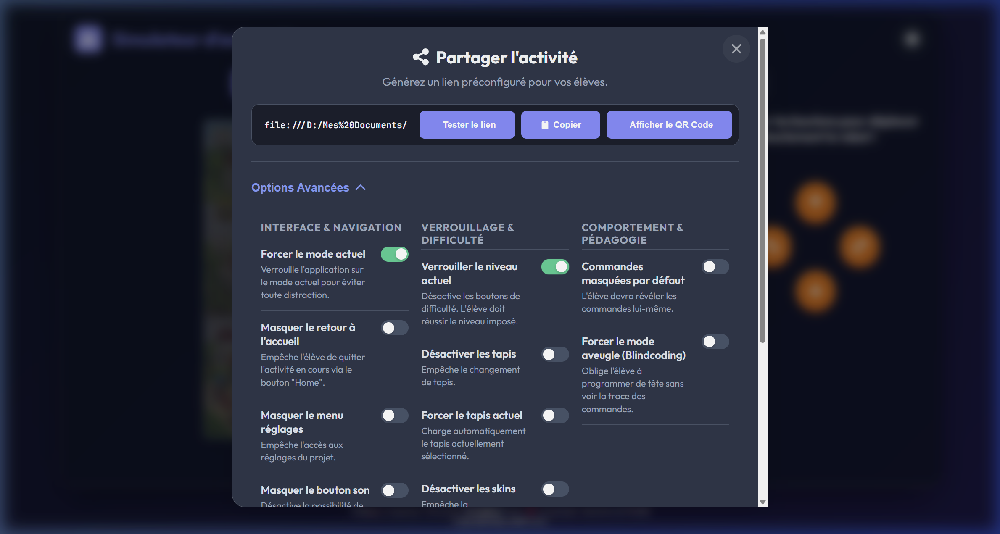
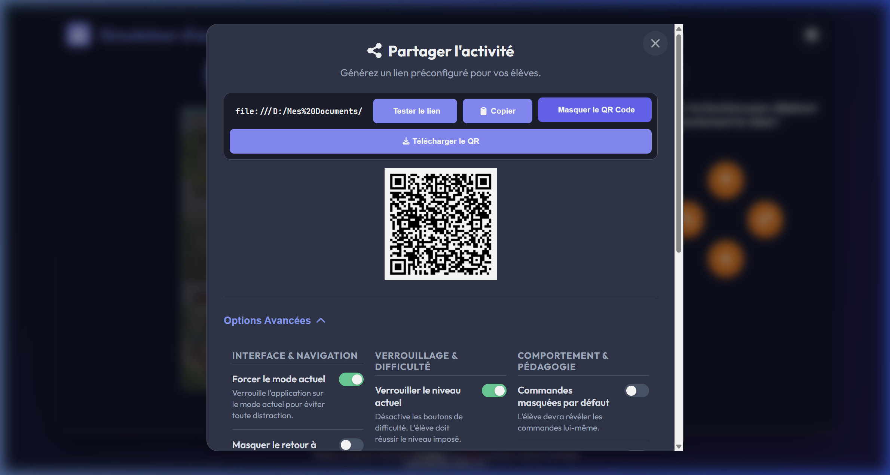

# Partager une activité avec ses élèves

Ce tutoriel décrit la procédure pour transmettre une activité paramétrée à une classe via un lien ou un QR Code.

---

## 1. Ouvrir le menu de partage

Depuis l'application concernée (ex. *Simulateur d'automate*) :

1. Cliquer sur l'icône **Engrenage ⚙** en haut à droite.
2. Sélectionner **« Partager l'activité »**.

---

## 2. Fenêtre de partage

Une fenêtre modale s'ouvre. Le lien généré intègre automatiquement :

- **L'onglet actif** (mode de jeu, ex. *Décodage*, *Pilotage*).
- **Le niveau de difficulté** sélectionné.

Trois boutons sont disponibles pour exporter le lien :

| Bouton | Fonction |
|---|---|
| **Tester le lien** | Ouvre le lien dans un nouvel onglet pour vérifier le rendu côté élève. |
| **Copier** | Copie le lien dans le presse-papiers. |
| **Afficher le QR Code** | Génère un QR Code (voir § 6). |

---

## 3. Profils rapides (Presets)

Pour faciliter la préparation, trois boutons de profils permettent d'appliquer automatiquement une sélection de réglages adaptés à différentes situations pédagogiques :

- **🎯 Mission :** « Mes élèves font exactement ce que j'ai préparé ». Ce profil verrouille le niveau de difficulté, force le mode de jeu actuel, empêche le retour à l'accueil et masque le menu des réglages.
- **🏋️ Entraînement :** « Je leur donne l'outil, ils explorent / refont à leur rythme ». Ce profil permet le changement de difficulté, force le mode de jeu actuel et empêche le retour à l'accueil.
- **🫶 Inclusif :** « J'ai un·e élève dys, TSA, ou non-latéralisé·e dans le groupe ». Ce profil active le thème à contraste élevé, désactive le son, active les couleurs directionnelles (si disponible), force le mode de jeu actuel et empêche le retour à l'accueil.

---

## 4. Options avancées

Un clic sur **« Options Avancées »** donne accès à des paramètres supplémentaires, regroupés en trois catégories.

#### A. Apparence & Confort
- **Contraste élevé** : Active le thème sombre à fort contraste dès l'ouverture de la page.
- **Pas de son** : Coupe les effets sonores par défaut.
- **Couleurs directionnelles** *(Automate)* : Applique les couleurs de déplacement (Mode Jeu de la grue).
- **Sans instructions** : Masque le bloc d'instructions situé sous le titre de la page.
- **Sans quadrillage** *(Automate)* : Supprime la grille visuelle du simulateur pour plus de difficulté.

#### B. Comportement & Pédagogie
- **Séquence masquée (toggle)** : La séquence d'ordres est cachée au démarrage ; l'élève doit l'ouvrir manuellement.
- **Mode aveugle (Blindcoding)** : Le bouton pour révéler la séquence de commandes est entièrement désactivé, l'affichage de la séquence est donc impossible. L'élève doit concevoir son programme uniquement de tête.
- **Pas de dictionnaire ASCII** *(Binaire & Message)* : Masque le tableau de correspondance entre code binaire et caractères.
- **Mode strict** *(Bit de parité)* : Désactive le retour visuel immédiat en cas d'erreur.
- **Débloquer l'éditeur** *(Pixel Art Binaire)* : Ouvre directement l'onglet créatif, même si les défis de base ne sont pas réussis.

#### C. Restrictions de navigation & d'Interface
- **Difficulté verrouillée** : Grise les boutons de niveau de difficulté (1 à 3 / Easy à Hard).
- **Mode actuel uniquement** : Masque la navigation entre les onglets pour bloquer l'élève sur le mode de jeu ou l'onglet sélectionné.
- **Pas de lien accueil** : Supprime le bouton pour revenir au portail EdNum (utile pour l'intégration plein écran ou l'encapsulation de l'outil).
- **Pas de réglages** : Enlève complètement l'icône de la roue dentée. L'élève n'aura plus accès aux options (son, couleur, skins, vitesse, etc.).

#### D. Restrictions et verrouillages divers
- **Sans tapis / Pas de skins** *(Automate)* : Désactive la personnalisation cosmétique.
- **Tapis imposé** *(Automate)* : Charge automatiquement le dernier tapis que l'enseignant a sélectionné. L'élève ne peut plus le changer.
- **Vitesse imposée** *(Automate)* : Charge automatiquement le niveau de vitesse actuel et désactive le sélecteur chez l'élève.
- **Carte réseau fixe** *(Routage Réseau)* : Bloque la carte (la topologie du réseau générée aléatoirement) afin que chaque élève de la classe ait exactement le même problème à résoudre.

> **Remarque :** chaque option cochée ajoute un paramètre à l'URL (ex. `&only=1&lockDiff=1`).

---

## 5. Paramètres cachés de l'URL

Quelques paramètres avancés ne sont pas disponibles directement dans l'interface et doivent être ajoutés manuellement à la fin du lien généré (par exemple : `&noRandom=1`).

- `&unlockAllSkins=1` : (*Automate*) Débloque instantanément tous les personnages et tapis de sol cachés du simulateur.
- `&noDrag=1` : (*Automate*) Désactive le glisser-déposer des blocs de commande, forçant l'utilisation des clics (pratique pour les publics DYS ou sur tableau interactif peu précis).
- `&noRandom=1` : Désactive les boutons permettant de relancer des exercices aléatoires.
- `&seed=1234` : Utilisé avec l'option "Carte réseau fixe" pour définir explicitement un numéro de graine aléatoire. Permet de générer la même topologie sur tous les appareils si la graine est identique.

---

## 6. Diffusion par QR Code

Procédure :

1. Régler les options avancées.
2. Cliquer sur **« Afficher le QR Code »**.
3. Cliquer sur **« Télécharger le QR »** pour enregistrer l'image.

Le QR Code peut ensuite être :
- imprimé et distribué aux élèves ;
- affiché au TBI ;
- inséré dans un document (polycopié, fiche, support numérique).

Une fois scanné, le QR Code ouvre directement l'application dans la configuration définie par l'enseignant.