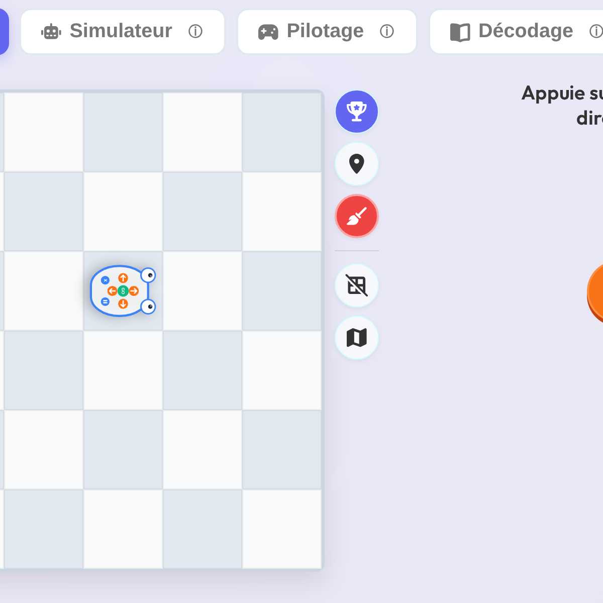
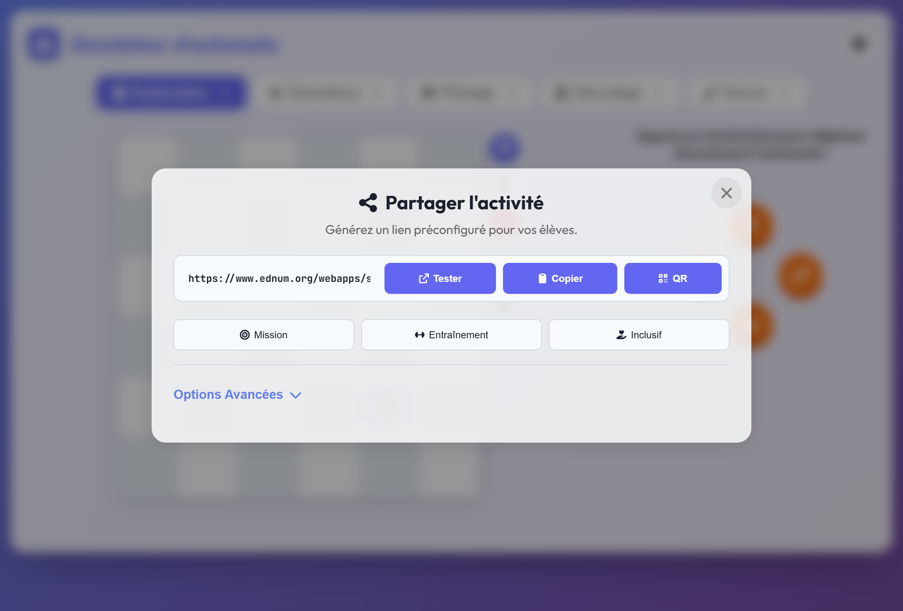
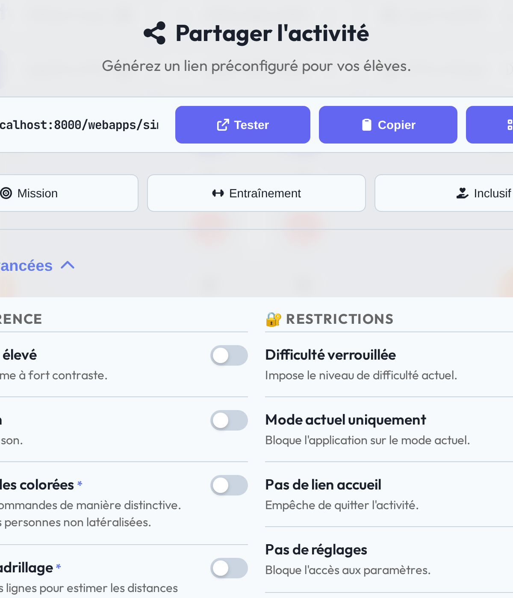

# 🔗 Partager une activité avec ses élèves

Ce guide de référence décrit la procédure complète pour configurer, personnaliser et transmettre une activité de la **Suite EdNum** à vos élèves via un lien direct ou un QR Code prêt à imprimer / projeter.

---

## 1. Ouvrir le menu de partage

Depuis n'importe quelle application de la suite :

1. Cliquez sur l'icône **Engrenage ⚙** (en haut à droite de l'écran).
2. Sélectionnez **« Partager l'activité »** (ou cliquez sur le bouton Partager présent dans certaines activités).

---

## 2. Fenêtre de partage & Exportation

La modale de partage prépare automatiquement une URL enrichie encodant :
- **L'onglet / mode de jeu actif** (ex. *Décoder*, *Pilotage*, *Entraînement*).
- **Le niveau de difficulté en cours** (Facile, Moyen, Difficile, Extrême).

### Boutons d'exportation disponibles :
| Bouton | Fonction |
|---|---|
| ↗ **Tester le lien** | Ouvre l'URL dans un nouvel onglet pour vérifier le rendu exact côté élève. |
| 📋 **Copier** | Copie le lien sécurisé dans votre presse-papiers. |
| 📱 **QR** | Génère instantanément le QR Code à l'écran. |
| 💾 **Télécharger le QR** | Enregistre l'image du QR Code (PNG) sur votre machine pour vos fiches pédagogiques. |

---

## 3. Profils rapides (Presets pédagogiques)

| Profil Rapide | Intention pédagogique | Réglages appliqués automatiquement |
|---|---|---|
| 🎯 **Mission** | *« Mes élèves font exactement ce que j'ai préparé. »* | Verrouille la difficulté + force le mode sélectionné + masque les réglages + retire le lien d'accueil. |
| 🏋️ **Entraînement** | *« Je leur donne l'outil, ils s'entraînent à leur rythme. »* | Force le mode sélectionné + retire le lien d'accueil + laisse la difficulté libre. |
| 🫶 **Inclusif** | *« J'ai un·e élève DYS, TSA ou non-latéralisé·e dans le groupe. »* | Active le contraste élevé + coupe le son + active les commandes colorées + retire le lien d'accueil. |

---

## 4. Options avancées détaillées

Cliquez sur **« Options Avancées »** pour affiner la configuration selon vos besoins pédagogiques :

### 🎨 A. Apparence & Confort
- **Contraste élevé (`&highContrast=1`) :** Active le thème sombre à haut contraste pour les élèves malvoyants ou les pièces très éclairées.
- **Couleurs de poids (`&coloredWeights=1`)** *(Routage Réseau)* : Colore dynamiquement les arêtes selon leur coût (UTI) pour faciliter l'estimation.
- **Pas de son (`&noAudio=1`) :** Coupe tous les effets sonores par défaut pour préserver le calme en classe.
- **Commandes colorées (`&coloredCmds=1`)** *(Automate)* : Associe une couleur distincte à chaque ordre de direction.
- **Masquer les instructions (`&noInstructions=1`) :** Retire les bandeaux d'explications sous le titre.
- **Pas de quadrillage (`&hideGrid=1`)** *(Automate)* : Supprime les lignes de repère pour corser l'évaluation des distances.

### 🧠 B. Pédagogie & Démarche cognitive
- **Partager ma grille personnalisée** *(Automate)* : Encode la taille de la grille, les obstacles posés, le trésor et l'orientation du robot créés au clavier (`&rows=...&cols=...&robot=...&obstacles=...&target=...`).
- **Commandes masquées (`&noCmdToggle=1`) :** Cache la liste des ordres saisis au démarrage ; l'élève doit cliquer pour l'ouvrir.
- **Mode aveugle / Blindcoding (`&blindcode=1`) :** Rend la séquence totalement invisible. L'élève doit concevoir et exécuter son programme de tête.
- **Pas de dictionnaire ASCII (`&hideDict=1`)** *(Mots secrets)* : Masque la table de correspondance pour forcer le calcul des puissances de 2.
- **Mode strict (`&strictMode=1`)** *(Bit de parité)* : Ne signale pas instantanément les erreurs pour évaluer l'auto-correction.
- **Mode Couleurs (`&colorMode=1`)** *(Pixel Studio)* : Ouvre directement l'activité en mode 4 couleurs (2 bits par pixel).

### 🔐 C. Restrictions d'interface & Navigation
- **Difficulté verrouillée (`&lockDiff=1`) :** Grise le sélecteur de niveau (l'élève reste sur le palier imposé).
- **Mode actuel uniquement (`&only=1`) :** Masque la barre d'onglets pour empêcher de changer de jeu.
- **Pas de lien accueil (`&noHome=1`) :** Désactive le bouton retour au portail général.
- **Pas de réglages (`&noSettings=1`) :** Supprime l'icône d'engrenage (aucun accès aux options).
- **Pas de skins (`&lockSkin=1`)** *(Automate)* : Empêche la modification de l'apparence du robot.
- **Sans choix de tapis (`&lockMat=1`)** *(Automate)* : Désactive le tiroir de choix des tapis.
- **Tapis imposé (`&forceMat=nom_tapis`)** *(Automate)* : Force le chargement d'un tapis spécifique.
- **Vitesse imposée (`&lockSpeed=1`)** *(Automate)* : Bloque la vitesse d'exécution.
- **Carte réseau fixe (`&lockTopology=1`)** *(Routage Réseau)* : Génère le même réseau pour toute la classe.

---

## 5. Paramètres d'URL experts (Ajout manuel)

Vous pouvez compléter manuellement vos URL avec les paramètres suivants :

| Paramètre | Application | Effet |
|---|---|---|
| `&unlockAllSkins=1` | Simulateur Automate | Débloque immédiatement l'ensemble des skins et tapis secrets. |
| `&noDrag=1` | Automate / Trier | Désactive le glisser-déposer au profit du clic direct (idéal TBI peu précis). |
| `&seed=1234` | Routage Réseau | Définit une graine aléatoire pour obtenir une topologie identique sur tous les postes. |
| `&importGrid=0110...` | Pixel Studio | Précharge un dessin matriciel dans l'éditeur libre à partir de sa chaîne binaire. |
| `&noNudges=1` | Toutes | Désactive les bulles d'aide et d'onboarding animées au démarrage. |

---

## 6. Diffusion par QR Code en Classe

1. Ajustez vos paramètres dans la modale de partage.
2. Cliquez sur **« QR »** puis sur **« Télécharger le QR »**.
3. Insérez le fichier image dans votre feuille de consignes ou projetez-le directement au tableau interactif.
4. Les tablettes ou smartphones des élèves scannent le code et ouvrent l'application préconfigurée sans aucune manipulation technique.

---

*Documentation mise à jour pour la Suite EdNum — AP EdNum (HEP-VS).*