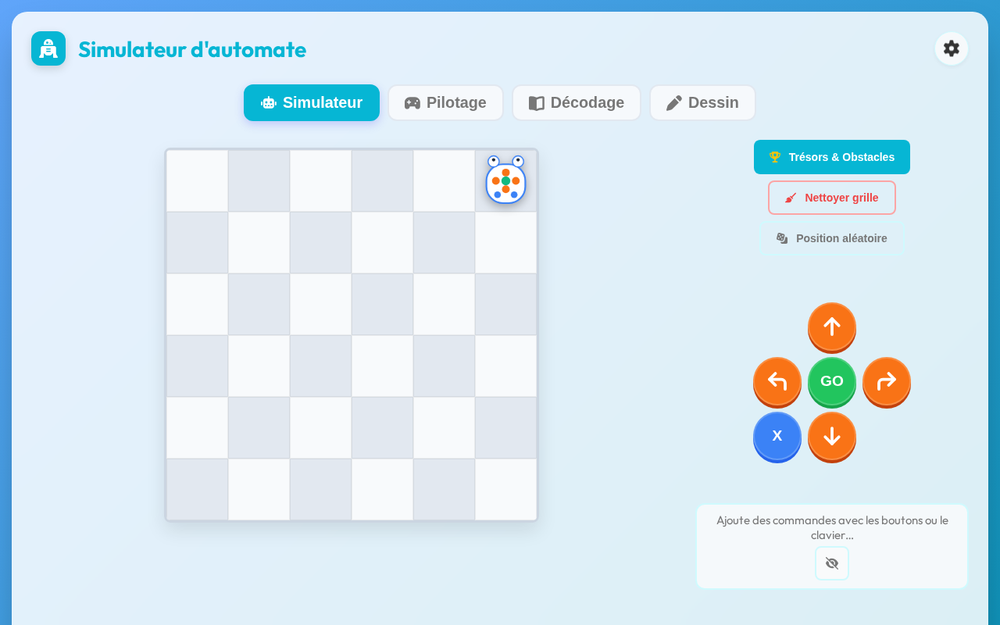
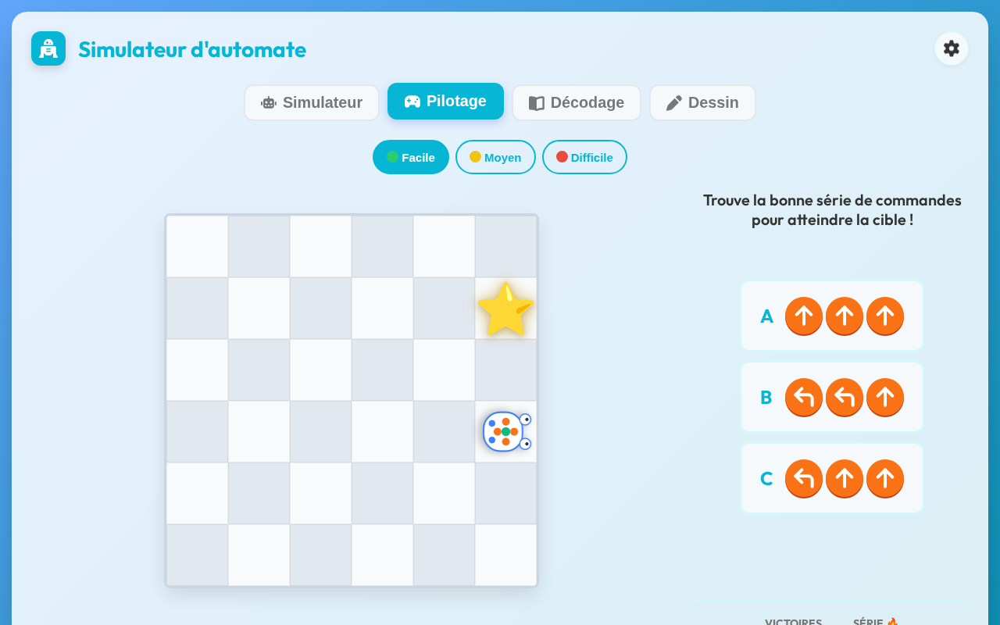
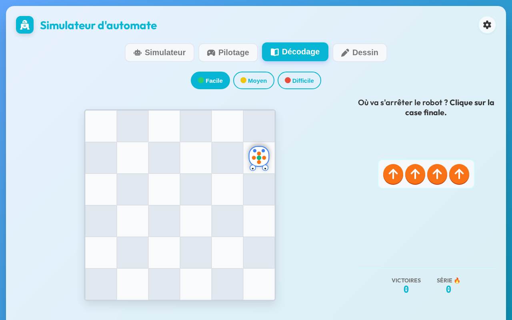
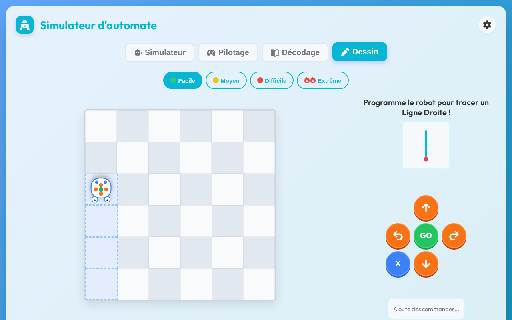

# 🤖 Mode d'emploi : Simulateur d'automate (Blue-Bot)

Bienvenue dans le guide d'utilisation du **Simulateur d'automate**, une application web interactive conçue pour accompagner l'enseignement de la robotique et de la pensée algorithmique à l'école primaire.

Ce simulateur permet aux élèves de s'entraîner à la programmation d'un automate (de type Blue-Bot) de manière ludique, à travers **4 modes** de difficulté progressive .

---

## 1. Mode Simulateur (Exploration Libre)

Ce mode est idéal pour une première prise en main de l'automate et des déplacements dans l'espace.

**Comment l'utiliser :**
- Utilisez les boutons du panneau de contrôle (Avancer, Reculer, Pivoter à gauche, Pivoter à droite) pour créer une séquence d'instructions. Les boutons directionnels sont **oranges** .
- Les instructions s'affichent sous forme de cartes dans la barre du programme.
- Appuyez sur le bouton **« GO »** (vert) pour lancer l'exécution de votre programme. L'automate se déplacera sur la grille en suivant vos instructions .
- Le bouton **« X »** (bleu) permet d'effacer la séquence d'instructions .
- Vous pouvez positionner le robot où vous le souhaitez en cliquant sur le bouton **« Position aléatoire »** (icône dé) ou en cliquant directement sur une case de la grille .
- Le bouton **« Trésors & Obstacles »** permet de placer des éléments à récolter et des obstacles à contourner sur la grille. Les éléments atteints par le robot s'affichent dans la zone « Éléments atteints » .
- Le bouton **« Nettoyer grille »** retire tous les obstacles et trésors placés .
- Un bouton **œil barré** (à côté de la barre du programme) permet de **masquer les commandes** pour transformer l'exercice en défi mémoire : on peut alors cliquer sur une commande pour la supprimer tout en gardant le mystère sur la séquence .
- Un compteur **Victoires** et une **Série 🔥** apparaissent lorsque vous collectez des trésors .

---

## 2. Mode Pilotage (Défis à choix multiples)

Ce mode propose des défis à résoudre : l'automate doit atteindre une cible précise. **Contrairement au mode Simulateur, vous ne programmez pas la séquence vous-même** : plusieurs propositions de programmes (A, B, C…) vous sont présentées, et vous devez choisir **la bonne série de commandes** qui permet au robot d'atteindre la cible .

**Comment l'utiliser :**
- Observez la position de l'automate et celle de la cible sur la grille.
- Analysez chaque proposition de séquence affichée au-dessus de la grille.
- Cliquez sur la proposition que vous pensez correcte. Les bonnes réponses se colorent en vert, les mauvaises en rouge .
- Un rappel peut apparaître pour vous indiquer que **l'automate peut aussi reculer** 💡 .
- **Niveaux de difficulté :**
  - **🟢 Facile :** Mouvements simples, pas d'obstacles.
  - **🟡 Moyen :** Introduction d'obstacles à contourner.
  - **🔴 Difficile :** Obstacles et chemins plus complexes à optimiser.
  - **🔥 Extrême :** Niveau **débloqué** uniquement après avoir progressé dans les niveaux précédents ; chemins maximaux avec contraintes renforcées .
- Le bouton **« Pilotage suivant »** (➡) apparaît après une bonne réponse pour passer au défi suivant .
- Un **score global** et une **série de victoires consécutives 🔥** sont affichés en bas de l'écran .

---

## 3. Mode Décodage (Lecture de code)

Ce mode inverse la logique : le programme est déjà écrit, et vous devez deviner où l'automate va s'arrêter !

**Comment l'utiliser :**
- Une séquence d'instructions est affichée à l'écran et l'automate est positionné sur la grille .
- Lisez la séquence de gauche à droite et imaginez mentalement le parcours du robot.
- **Cliquez sur la case de la grille** où vous pensez que l'automate terminera son parcours après l'exécution complète du programme .
- Une fois que vous avez cliqué, le programme s'exécute visuellement pour vérifier votre prédiction.
- C'est un excellent exercice pour travailler la **décentration cognitive** (distinguer gauche/droite relatives au robot) et la **mémoire de travail**.
- La difficulté augmente progressivement (plus d'instructions, chemins plus complexes), avec également un niveau **Extrême** à débloquer .

---

## 4. Mode Dessin (Création géométrique)

Dans ce mode, l'automate est équipé d'un stylo imaginaire et **laisse une trace** derrière lui au fil de ses déplacements. Le but est de reproduire des formes géométriques ou des motifs.

**Comment l'utiliser :**
- Le défi affiche les cases à parcourir (cases cibles en **pointillés bleus**) pour former la figure demandée .
- Programmez les mouvements de l'automate de manière à passer par toutes les cases cibles. Les cases parcourues se remplissent progressivement .
- **Attention :** pour les formes fermées (carré, rectangle…), l'automate doit passer par toutes les cases du contour. Veillez à bien compter les déplacements et les rotations.
- Ce mode permet d'introduire des concepts de **géométrie** : angles droits, longueurs, polygones.
- La complexité des figures augmente avec les niveaux de difficulté.

---

## 🎨 Personnalisation

Le menu **Options** (icône engrenage ⚙ en haut à droite) donne accès à plusieurs réglages  :

- **Changer de tapis** 🗺 : ouvre un tiroir latéral permettant de choisir un fond de grille (tapis pédagogique : ville, etc.), d'ajuster son **opacité** (10 à 100 %) et même de régler la **taille de la grille** (de 4×4 à 10×10 cases) .
- **Changer de skin** 🎨 : permet de personnaliser l'apparence du robot et de la piste (Bee-Bot, Licorne 🌈, Cyber-Bot, Volcan 🌋, Botanique 🌿, Hélicoptère, Train 🚂, F1 🏎, etc.). Certains skins sont **verrouillés** et se débloquent en progressant .
- **Voir mes statistiques** 📊 : accès au tableau de bord des scores.
- **Vitesse** ⏱ : bascule entre vitesse normale et vitesse rapide (2×) .
- **Thème clair / sombre** 🌙 : bascule entre les deux modes d'affichage .
- **Son** 🔊 : active ou désactive les effets sonores .

---

### Astuces supplémentaires

- **Accessibilité :** l'application est utilisable **au clavier** (flèches directionnelles, Espace, Entrée) dans le mode Simulateur .
- **Lien « Aller au contenu principal »** présent en haut de page pour faciliter la navigation au clavier/lecteur d'écran .
- **Hors-ligne :** une fois chargée une première fois, l'application fonctionne entièrement **sans connexion Internet**.
- **Astuce pédagogique :** utilisez le bouton de masquage des commandes (mode Simulateur) pour transformer un exercice simple en véritable défi de mémoire et de décodage !
