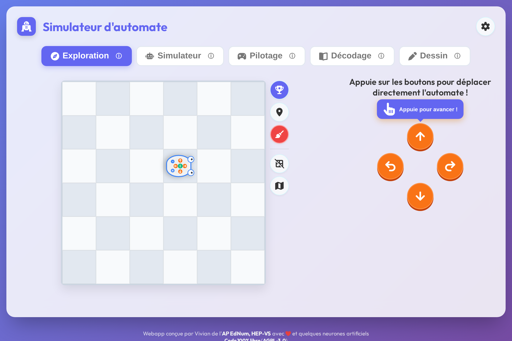
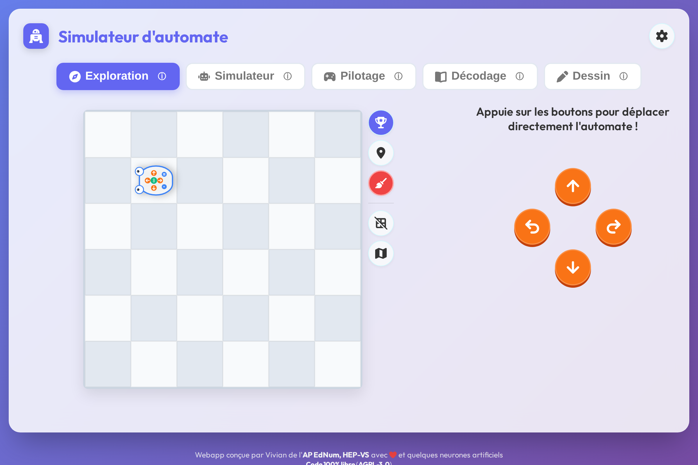

# 🤖 Mode d'emploi : Simulateur d'automate

Bienvenue dans le guide d'utilisation complet du **Simulateur d'automate**, une application web interactive conçue pour accompagner l'enseignement de la robotique et de la pensée algorithmique à l'école primaire et au début du secondaire (Cycles 1 et 2 PER, Décodages 3-4H à 7-8H).

Ce simulateur permet aux élèves de programmer un automate (de type Blue-Bot / Bee-Bot) de manière ludique et intuitive, à travers **5 modes principaux** de difficulté progressive et plusieurs modes transversaux.

---

## 🌟 Enjeux Pédagogiques (Utilité en classe)

L'utilisation de ce simulateur en classe développe des compétences fondamentales en éducation numérique et en mathématiques :
- **Pensée algorithmique :** Décomposer un cheminement complexe en une suite d'instructions simples, ordonnées et sans ambiguïté.
- **Décentration cognitive :** Distinguer la gauche et la droite relatives au robot, indépendamment de sa propre position (essentiel dans les modes *Pilotage* et *Décodage*).
- **Repérage spatial et géométrie :** Évaluer des distances (nombre de cases), anticiper des trajectoires et appréhender des concepts géométriques (angles droits, périmètres, surfaces).
- **Anticipation et mémoire de travail :** Planifier mentalement une séquence complète avant son exécution, en s'appuyant sur des fonctionnalités comme le **Blindcoding** (programmation à l'aveugle).
- **Démarche essai-erreur positive :** Analyser les bugs, comprendre l'origine d'un écart de trajectoire et corriger son programme pas-à-pas.

---

## 🎮 Les Modes Transversaux (Fonctionnalités Activables)

Avant de détailler les 5 modes principaux, voici les fonctionnalités activables via des boutons dédiés dans l'interface, particulièrement utiles dans les modes **Exploration** et **Simulateur** :

- **🎒 Ramasser les objets (Mode Collecte) :** Lorsque cette option est activée, l'automate doit se déplacer sur les éléments interactifs du tapis (ex: formes géométriques, trésors, personnages de contes) pour les collecter. Un compteur de victoires et une série 🔥 récompensent la réussite.
- **🃏 Mode Chasse aux paires :** Ce mode transforme la grille en un jeu de mémoire géant ! Des cartes retournées apparaissent sur la grille. Déplacez l'automate sur les cartes pour les révéler et formez des paires (illustrations, chiffres, mots).
- **🔤 Mode Épeler (Spell Mode) :** Sur les tapis alphabétiques, l'automate est guidé pour épeler des mots lettre après lettre en se déplaçant sur les cases correspondantes.
- **💡 Bulle d'aide d'onboarding :** Lors de la toute première visite en mode Exploration, une infobulle animée attire l'attention sur le bouton « Avancer » pour faciliter la prise en main immédiate par les jeunes élèves (désactivable via le paramètre `?noNudges=1`).

---

## 1. Mode Exploration (Déplacement direct)

Ce mode permet de comprendre le comportement mécanique de l'automate sans avoir à anticiper une séquence complète. Le robot réagit instantanément à chaque appui.

**Comment l'utiliser :**
- Utilisez le panneau de contrôle directionnel (**Avancer ⬆**, **Reculer ⬇**, **Pivoter à gauche ↺**, **Pivoter à droite ↻**).
- À chaque clic ou appui clavier, l'automate exécute immédiatement l'action sur la grille.
- **Positionner le robot :** Cliquez sur le bouton **« Position aléatoire »** (icône punaise 📍) ou cliquez directement sur une case de la grille pour y téléporter le robot.
- **Trésors & Obstacles :** Le bouton dédié permet d'ajouter des cibles à atteindre et des briques d'obstacles à contourner.
- *Idéal pour :* la découverte en Cycle 1 (4-7 ans) ou l'expérimentation libre au TBI.

---

## 2. Mode Simulateur (Programmation par blocs)

Ce mode reproduit fidèlement la programmation par touches d'un robot de sol physique (Blue-Bot).

**Comment l'utiliser :**
- Construisez votre séquence en cliquant sur les boutons d'ordres. Chaque commande s'ajoute dans la **bande de programme**.
- Pour supprimer une instruction précise, cliquez directement sur sa carte dans la bande.
- Le bouton **« GO »** (vert) lance l'exécution pas-à-pas de l'ensemble du programme.
- Le bouton **« X »** (bleu) efface toute la séquence d'instructions.
- Le bouton **œil barré** (à côté de la bande) permet de **masquer les commandes** pour transformer l'exercice en défi de mémorisation.
- Les compteurs **Victoires** et **Série 🔥** valorisent les réussites consécutives sans erreur.

---

## 3. Mode Pilotage (Défis à choix multiples)

Dans ce mode, la cible est fixée et plusieurs propositions de programmes complets sont soumises à l'élève. L'objectif est d'identifier la seule séquence correcte menant au but sans percuter d'obstacle.

**Niveaux de difficulté :**
- **🟢 Facile :** Trajets courts, aucun obstacle sur la grille.
- **🟡 Moyen :** Trajets plus longs avec des obstacles simples à contourner.
- **🔴 Difficile :** Grilles encombrées nécessitant des détours précis.
- **🔥 Extrême :** Niveau débloqué après progression dans les niveaux précédents ; labyrinthes complexes avec contraintes renforcées.

---

## 4. Mode Décodage (Lecture et prédiction de trajectoire)

Ce mode inverse la démarche : le programme est déjà affiché, et l'élève doit deviner mentalement où l'automate terminera sa course.

**Comment l'utiliser :**
1. Observez l'orientation initiale de l'automate et la séquence de commandes.
2. Déplacez mentalement le robot case par case en intégrant les rotations sur place.
3. **Cliquez sur la case d'arrivée présumée.**
4. L'automate exécute alors le programme pour valider ou invalider la réponse.
5. *Bénéfice clé :* Renforce puissamment la **décentration spatiale** et l'anticipation sans support matériel.

---

## 5. Mode Dessin (Création géométrique)

Dans ce mode créatif, l'automate laisse une trace colorée sur chaque case parcourue.

**Comment l'utiliser :**
- **Défis de reproduction :** Le plateau met en surbrillance des cases cibles en pointillés bleus formant un carré, un rectangle, un chiffre ou un motif.
- Programmez la trajectoire exacte pour colorier toutes les cases demandées sans en oublier.
- *Lien interdisciplinaire :* Travaille la géométrie (angles droits, polygones, périmètre).

---

## 6. Accessibilité & Raccourcis Clavier Avancés

L'application est 100% accessible sans souris ni écran tactile grâce à son système de navigation au clavier :

### ⌨️ Programmation au clavier (Modes Simulateur & Dessin)
| Touche | Action |
|---|---|
| ⬆ ⬇ ⬅ ➡ | Ajouter les commandes Avancer, Reculer, Pivoter à gauche, Pivoter à droite |
| `Retour arrière` (Backspace) | Effacer la dernière instruction |
| `Entrée` | Exécuter le programme (Bouton GO) |

### 🖥️ Mode Édition de Grille au Clavier (Navigation tactile/DYS)
Appuyez sur la touche **Tabulation (`Tab`)** pour activer le curseur néon interactif sur la grille :
- **Flèches directionnelles :** Déplacer le curseur de sélection sur les cases.
- **`Entrée` ou `Espace` :** Téléporter le robot sur la case sélectionnée.
- **Touche `R` :** Pivoter l'automate de 90° dans le sens horaire.
- **Touche `O` :** Poser ou retirer un obstacle (brique rouge).
- **Touche `T` :** Placer la cible / trésor sur la case.

---

## 🎨 Personnalisation & Réglages (Engrenage ⚙)

- **Changer de tapis 🗺 :** Sélection parmi des dizaines de tapis pédagogiques (Ville, Espace, Forêt, Formes géométriques, etc.), réglage de l'opacité et choix des dimensions de grille (de 4×4 à 10×10 cases).
  - **Tapis personnalisé :** Importez votre propre image depuis votre ordinateur ou tablette. L'image est stockée localement dans le navigateur pour fonctionner hors-ligne.
- **Changer de skin 🎨 :** Personnalisation de l'apparence du robot (Bee-Bot classique, Licorne 🌈, Cyber-Bot, Volcan 🌋, etc.).
- **Vitesse ⏱ :** Bascule entre vitesse normale et accélérée (2×).
- **Commandes colorées 🧒 :** Attribution de couleurs distinctes à chaque bouton directionnel pour les élèves non latéralisés.
- **Thèmes 🌙 :** Thème clair, sombre et mode **Contraste Élevé** (WCAG AA).
- **Son 🔊 :** Effets sonores Web Audio synthétisés (zéro fichier externe).

---

## 🔗 Partage & Différenciation en Classe

Le menu **Partager l'activité** permet de générer un lien ou un QR Code sur mesure :
- **Verrouiller un niveau ou un mode unique** (ex. `&only=1&lockDiff=1`).
- **Imposer un tapis et des dimensions précises** (`&forceMat=city&rows=6&cols=6`).
- **Partager une grille personnalisée** conçue par l'enseignant avec ses propres obstacles et trésors (`&rows=5&cols=5&robot=0,0,0&obstacles=1,2;2,3&target=4,4`).
- **Activer le Blindcoding** pour évaluer la mémoire (`&blindcode=1`).

*(Consultez le [Guide complet de partage](MODE_EMPLOI_PARTAGE.md) pour la liste exhaustive des paramètres).*

---

*Conçu par Vivian Epiney (AP EdNum, HEP-VS) sous licence libre AGPL-3.0. 100% hors-ligne et respectueux des données personnelles.*
